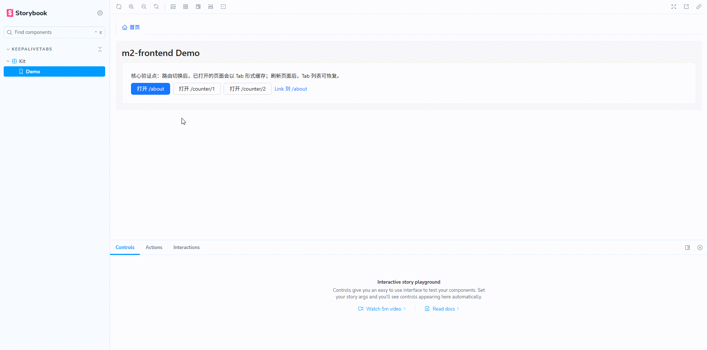
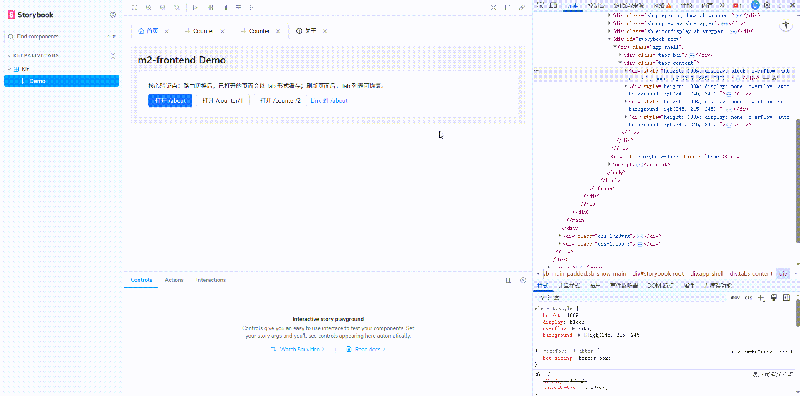
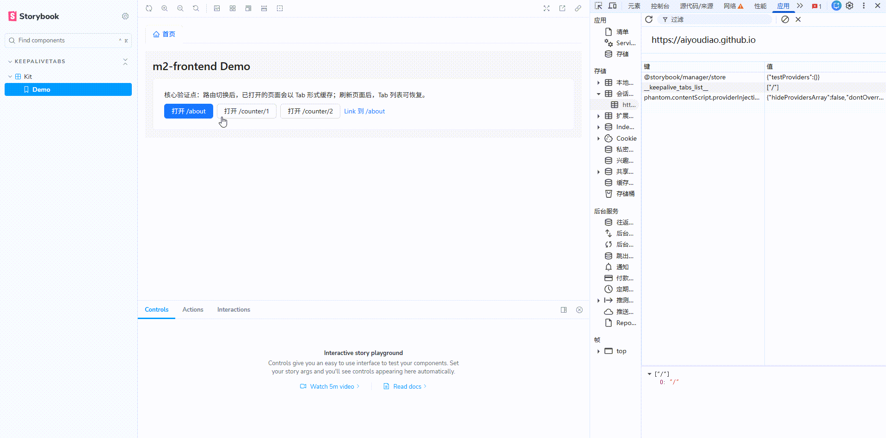

# KeepAlive Tabs Kit

[](https://github.com/aiyoudiao/keepalive-tabs-kit/actions/workflows/storybook-pages.yml)
[](./LICENSE)

一个基于 **React Router v6** 的 KeepAlive Tabs 方案：支持路由驱动页签、拖拽排序、右键操作、页面缓存、刷新恢复，以及可扩展的缓存策略（`max` / `ttl` / `reuse` / `strategy`）。

> 这个仓库既可作为可运行 Demo，也可以作为 npm 包在业务项目中快速接入。

---

## 演示

<p align="center">
  
</p>
<p align="center">
  
</p>
<p align="center">
  
</p>

- 在线预览（GitHub Pages）：https://aiyoudiao.github.io/keepalive-tabs-kit/
- Storybook：同上（Pages 站点即 Storybook 静态产物）

---

## 特性总览

- **路由驱动 Tabs**：访问路由自动生成页签
- **KeepAlive 缓存**：Tab 切换不卸载页面，保留组件状态
- **拖拽排序**：支持页签顺序调整并持久化
- **右键菜单**：刷新、关闭当前、关闭左侧/右侧、关闭其它
- **刷新恢复**：会话内刷新后可恢复 Tabs 列表
- **扩展能力**：
  - Core/UI 分层（`useKeepAliveManager` + `KeepAliveLayout`）
  - 可插拔持久化存储（`storage` adapter）
  - 生命周期回调（`onTabOpen` / `onTabClose` / `onRestore`）
  - 多实例命名空间隔离（`namespace`）
  - 缓存淘汰策略（`lru` / `fifo`）

---

## 快速开始

### 环境要求

- Node.js 18+（推荐 20）
- pnpm 8+

### 本地开发

```bash
pnpm install
pnpm dev
```

打开：`http://localhost:8000/`

### 构建

```bash
pnpm build
```

---

## npm 包接入

```bash
pnpm add keepalive-tabs-kit
# 或 npm i keepalive-tabs-kit
```

```tsx
import { KeepAliveLayout, type RouteConfig } from 'keepalive-tabs-kit';
import 'keepalive-tabs-kit/style.css';
```

### 最小路由示例

```tsx
import { createBrowserRouter } from 'react-router-dom';
import { KeepAliveLayout, type RouteConfig } from 'keepalive-tabs-kit';

const routeConfig: RouteConfig = {
  '/': { name: '首页' },
  '/about': { name: '关于' },
  '/counter/:id': { name: 'Counter' },
  '/404': { name: '404', keepAlive: false },
};

export const router = createBrowserRouter([
  {
    path: '/',
    element: <KeepAliveLayout routeConfig={routeConfig} />,
    children: [
      { index: true, element: <Home /> },
      { path: 'about', element: <About /> },
      { path: 'counter/:id', element: <Counter /> },
      { path: '*', element: <NotFound /> },
    ],
  },
]);
```

---

## API

### `KeepAliveLayout`

```ts
type KeepAliveLayoutProps = {
  routeConfig: RouteConfig;
  namespace?: string;
  storage?: {
    read: (key: string) => string | null;
    write: (key: string, value: string) => void;
  };
  onTabOpen?: (payload: { path: string; title: string }) => void;
  onTabClose?: (payload: { path: string; title: string }) => void;
  onRestore?: (paths: string[]) => void;
};
```

| 字段 | 说明 |
| --- | --- |
| `routeConfig` | 路由元信息配置（支持静态路径与动态 pattern） |
| `namespace` | 存储命名空间，多个 KeepAlive 容器互不干扰 |
| `storage` | 自定义持久化实现，默认 `sessionStorage` |
| `onTabOpen` | 新 tab 打开时回调 |
| `onTabClose` | tab 关闭/淘汰时回调 |
| `onRestore` | 初始恢复缓存 keys 时回调 |

### `RouteInfo`

```ts
type RouteInfo = {
  name: string;
  icon?: React.ReactNode;
  keepAlive?:
    | boolean
    | {
        enabled?: boolean;
        max?: number;
        ttl?: number;
        reuse?: boolean;
        strategy?: 'lru' | 'fifo';
      };
};
```

#### 缓存策略说明

- `keepAlive: false`：该路由不缓存
- `max`：最大缓存 tab 数
- `ttl`：缓存有效期（毫秒）
- `reuse`：是否忽略 query（默认 `true`）
- `strategy`：超限淘汰策略
  - `lru`：最近最少使用（默认）
  - `fifo`：先进先出

---

## Core / UI 分层说明

- `useKeepAliveManager`：核心状态管理与缓存策略（无 UI）
- `KeepAliveLayout + TabsBar`：默认 antd UI 实现

你可以复用 core hook 自定义 Tabs 头部与内容区：

```ts
import { useKeepAliveManager } from 'keepalive-tabs-kit';
```

---

## 工程命令

```bash
pnpm dev              # 本地开发
pnpm build            # 构建 demo + library
pnpm build:lib        # 仅构建 library 产物
pnpm preview          # 预览构建产物
pnpm storybook        # 启动 Storybook
pnpm build-storybook  # 构建 Storybook
pnpm test             # 运行测试
pnpm typecheck        # 类型检查
```

---

## 常见问题

### 为什么不把 `useOutlet()` 放进 state？

`useOutlet()` 每次渲染可能产生新引用；若将其放入 state 并在 effect 中反复写入，容易触发循环更新（`Maximum update depth exceeded`）。当前实现将缓存内容放在 ref 中管理。

### 缓存数据默认存在哪里？

默认使用 `sessionStorage['__keepalive_tabs_list__:<namespace>']` 持久化路由 key。

---

## Roadmap / 规划

- [docs.npm-plan.md](./docs.npm-plan.md)

---

## 贡献与规范

- [CONTRIBUTING.md](./CONTRIBUTING.md)
- [CODE_OF_CONDUCT.md](./CODE_OF_CONDUCT.md)
- [SECURITY.md](./SECURITY.md)

---

## License

MIT License，见 [LICENSE](./LICENSE)。
